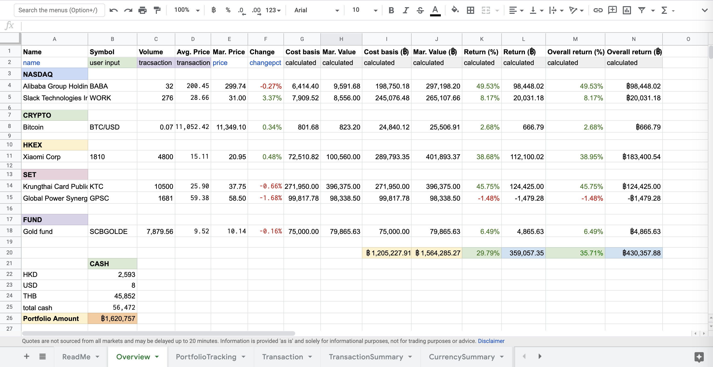
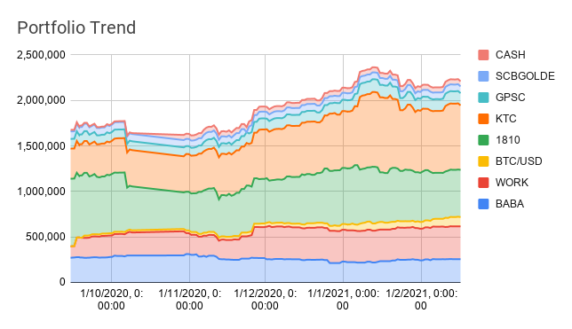

# InvestmentPortfolio
Please check out this [template spreadsheet](https://docs.google.com/spreadsheets/d/1w3R4SSCoHAxi5tc2f4QI8hnFmzJQpaBJSzW_MJ-WYmI/edit?usp=sharing)
and feel free to make a copy of the file by going to `File` then `Make a Copy` 

Now, let's build your own investment portfolio dashboard on googlesheet !! 

<!-- TABLE OF CONTENTS -->
## Table of Contents

* [About the Project](#about-the-project)
* [Detail](#detail)
* [Usage](#usage)
* [Instruction](#instruction)
* [Troubleshooting](#troubleshooting)
* [Disclaimer](#disclaimer) 
* [Contact](#contact)
* [Acknowledgements](#acknowledgements)

<!-- ABOUT THE PROJECT -->
## About The Project

We build a google sheet which can automatically track all owned assets; stocks(HKEX, NASDAQ, SET, etc.), cryptocurrencies, mutual funds etc. to provide insight into historical dynamic wealth position and real-time dashboard for better financial decision making

<!-- DETAIL -->
## Technical Detail

1. we use GooglefinanceAPI to fetch data of stocks in HKEX, NASDAQ & Cryptocurrencies
2. we use Web scraping to fetch data of stocks in SET & Mutual funds
3. `PortfolioTrending` script is for recording portfolio position (you need to set this script to run daily at project's trigger)
4. `AutoRefresh` script is for making sure that every data have already downloaded before recording (it may take a few second to fetch data from website)
5. `CryptoFinance` script is (right now) only for fetching 24 hrs pct change of cryptocurrencies 

<!-- USAGE EXAMPLES -->
## Usage

from the [template spreadsheet](https://docs.google.com/spreadsheets/d/1w3R4SSCoHAxi5tc2f4QI8hnFmzJQpaBJSzW_MJ-WYmI/edit?usp=sharing), we provide an example of portfolio that include stocks(HKEX, NASDAQ, SET), cryptocurrencies, mutual funds. This project use Thai Baht as the main currency.

### Instruction

1. Enter the number of money you deposit to/withdraw from portfolio
2. Enter record of currency exchange 
3. Enter stock symbol, stock market, price, commission fee
4. Add row for new stock, and other information will be fetched from other sheet, website, or API.
5. Set the `PortfolioTrending` script to record portfolio position daily by going script editor -> project's trigger

<!-- Troubleshooting -->
## Troubleshooting
if you find any **bug**, please report them at the [open issues](https://github.com/sunncyn/InvestmentPortfolio/issues).
### FAQ

1. Can not scape data from SET - error show that `couldn't fetch the data` : try change from `https` to `http` and vice versa

<!-- Disclaimer -->
## Disclamer
All information provided on this spreadsheet is for informational purposes only and does not constitute professional financial advice. There can be errors with this tool and the sources it pulls from. The creator does not take responsibility for those errors and is not obligated to correct them.

<!-- CONTACT -->
## Contact

Chayanont Potawananont (Sun) - chayanont1997@hotmail.com

Project Link: [https://github.com/sunncyn/InvestmentPortfolio](https://github.com/sunncyn/InvestmentPortfolio)

<!-- ACKNOWLEDGEMENTS -->
## Acknowledgements
This project was inspired from [Create the Google Finance Portfolio in Google Sheets](https://www.youtube.com/watch?v=mZi5Oe7Vsfg&t=205s) by `danesh j`
* [Official document for GOOGLE FINANCE function](https://support.google.com/docs/answer/3093281?hl=en)
* [Google Sheets function list](https://support.google.com/docs/table/25273?hl=en)
* [Auto-refresh script](https://stackoverflow.com/questions/33872967/periodically-refresh-importxml-spreadsheet-function)

<!-- MARKDOWN LINKS & IMAGES -->
<!-- https://www.markdownguide.org/basic-syntax/#reference-style-links -->
[product-screenshot]: images/screenshot.png
